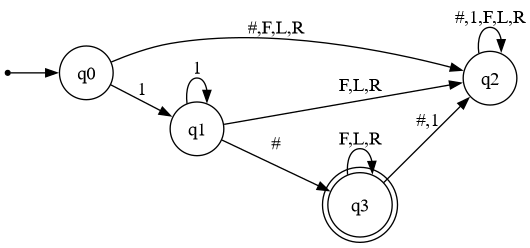
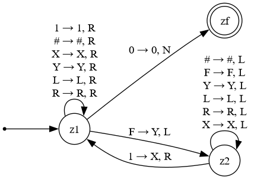

# Robot_program; Deterministische Finite Automata & Turing Machine

**Name:** Elias Pöschl & Eymen Kücükkaraca  
**Datum:** 03. Juni 2026  

***
<br>

# Beschreibung der Aufgabe

Eine Applikation besser gesagt ein Roboter, welches eine Zeichenkette liest, davon Informationen, wie Treibstoffmenge, Schritt vorwärts fahren, nach links drehen und ähnliches, erkennt und dies ausführt. Genau dafür brauchen wir eine zweistufige Prüfung. Zuerst prüfen wir, ob die Eingabe syntaktisch korrekt ist, und danach ob ausreichende Treibstoff vorhanden ist.

<br>

# Eingabesprache

~~~text
1111#FFRFL
~~~

| Komponente | Bedeutung |
|---|---|
| `1111` | sind die Treibstoffmengen |
| `#` | trennt Treibstoff und Programm, es darf nur einmal vorkommen |
| `F` | macht einen Schritt vorwärts, verbraucht genau eine Einheit Treibstoff |
| `R` | dreht die Roboter nach rechts |
| `L` | dreht die Roboter nach links |

### Syntaktisch gültige Eingaben

```
1#
1#F
111#FFR
1111#RRLL
11111#FFRFL
```

<br>


# Deterministische Endliche Automat  

Prüft ob die Eingabe valiide ist. Er erkennt genau die Sprache. Er arbeitet mit 4 Zuständen; `q0`, `q1`, `q2`, `q3`.

### Parametern beim Modell:

| Parametern | Bedeutung |
|---|---|
| `states` | Mögliche Zustände |
| `input_symbols` | Alle möglichen / erlaubten Zustände |
| `initial_state` | Start beim Zustand xy |
| `final_states` | Ende beim Zustand xy |
| `transitions` | Mögliche Durchgänge |

<br>

### Zustände:
| Zustand | Zeichen `1` | Zeichen `#` | Zeichen `F` | Zeichen`L`| Zeichen `R` | 
|---|---|---|---|---|---|
| `q0` | `q1` | `q2` | `q2` | `q2` | `q2` |
| `q1` | `q1` | `q3` | `q2` | `q2` | `q2` |
| `q2` | `q1` | `q2` | `q2` | `q2` | `q2` |
| `q3` | `q2` | `q2` | `q3` | `q3` | `q3` |

<br>

# Graphische Darstellung des deterministischen endlichen Automaten



<br>


# Turing Maschine

Die Turingmaschine prüft, ob für jeden `F`-Befehl im Programm eine unverbrauchte Treibstoffeinheit (`1`) vorhanden ist. Sie erhält nur Eingaben, die der DFA bereits akzeptiert hat.

In der konkreten Implementierung wird eine deterministische Turingmaschine (DTM) aus `automata-lib` verwendet.

<br>

| Symbol | Bedeutung |
|---|---|
| `1` | Noch verfügbare Treibstoffeinheit |
| `X` | Bereits verbrauchte Treibstoffeinheit |
| `#` | Trennzeichen |
| `F` | Noch nicht verarbeiteter Fahrbefehl |
| `Y` | Bereits verarbeiteter Fahrbefehl `F` |
| `L` | Linksdrehung, verbraucht keinen Treibstoff |
| `R` | Rechtsdrehung, verbraucht keinen Treibstoff |
| `0` | Blank-Symbol / leeres Bandfeld |

<br>


Der verwendete Code arbeitet mit genau drei Zuständen:

| Zustand | Bedeutung |
|---|---|
| `z1` | Suche von links nach rechts das nächste unverarbeitete `F` |
| `z2` | Gehe nach links und suche eine freie Treibstoffeinheit `1` |
| `zf` | Endzustand, akzeptiert die Eingabe |

<br>

# Graphische Darstellung von Turing Maschine



<br>

# Tabelle mit Testfällen


Die Tests sind aufgeteilt in `test_dfa.py` (DFA-Prüfung) und `test_tm.py` (TM-Prüfung). Ausgeführt werden sie mit `pytest`.

### DFA-Tests (`tests/test_dfa.py`)

#### Gültige Eingaben – DFA soll akzeptieren

```python
@pytest.mark.parametrize("robot", [
    "1#",
    "1#F",
    "111#FFR",
    "1111#RRLL",
    "11111#FFRFL"
])
def test_dfa_true(robot):
    assert check_robot(robot) == True
```

#### Ungültige Eingaben – DFA soll verwerfen

```python
@pytest.mark.parametrize("robot", [
    "#",
    "#FFR",
    "111",
    "111FFR",
    "111#FX",
    "11##FF"
])
def test_dfa_false(robot):
    assert check_robot(robot) == False
```

### TM-Tests (`tests/test_tm.py`)

#### Ausreichend Treibstoff – TM soll akzeptieren

```python
@pytest.mark.parametrize("robot", [
    "111#FFR",
    "11#FFR",
    "111#RRLL",
    "111#FFF",
    "111111111#FFFLRFFFLRLRLFFF"
])
def test_tm_true(robot):
    assert check_robot(robot) == True
    assert move_robot(robot) == True
```

#### Zu wenig Treibstoff – TM soll verwerfen

```python
@pytest.mark.parametrize("robot", [
    "1#FFR",
    "11#FFF",
    "1#FRRLLLLRLRLF",
    "11#LRLFLLFLF",
    "11111#FFLRFFLRFFLRF"
])
def test_tm_false(robot):
    assert check_robot(robot) == True
    assert move_robot(robot) == False
```

<br>

# warum reicht der DFA nicht allein für die Treibstoffprüfung aus

Dfa prüft nur ob die Sprache valiide bzw korrekt ist. 
